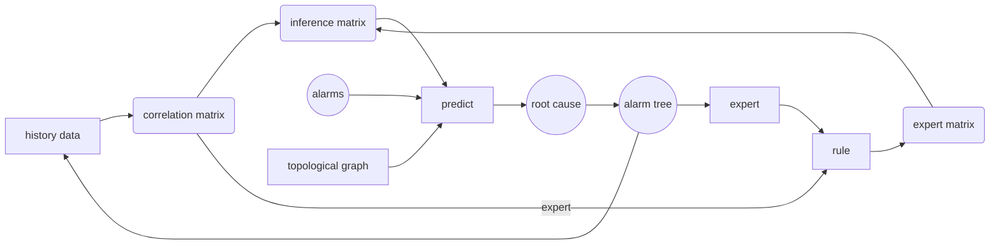

**Project**: Proof-of-concept (PoC) of AN (autonomous network) in communication network.
**Project Target**:
-	build up an intelligent system which can detect, fix and even predict possible problems with the analysis of alarms, device information and other details in the communication network to reduce human costs while lifting efficiency\
-	Stage I can be roughly divided into three parts: workflow construction, message handling and root cause analysis (RCA). 

My task is to propose an RCA algorithm. The RCA algorithms should be able to find the root cause and the root cause tree from a bunch of alarms. Multiple algorithms have been considered, and here are some of them:
-	FP-Growth
-	GCN
-	Random Forest
-	Correlation

**GCN**: 
With the help of AI, we first considered using graph convolutional network (GCN). Like CNN (convolutional neural network), GCN considers a network’s topology, aggregates information from nearby nodes and uses learning algorithms like Feed-Forward Neural Network (FNN) to train the model for desirable outcomes. It seems that GCN fits RCA well since GCN leverages the topology structure, but one problem is that the training data lacks labels. Though experts have given some figures showing alarms’ levels of harmfulness, no real relation is given. Besides, GCN can not be used to find the root cause directly, since one GCN layer means aggregating information around once, and two layers only aggregate information twice. If the root cause tree has a high height, all the information cannot be delivered to the root cause. However, one layer can be used to find the relationship between neighboring alarms, and one of my colleagues is trying this algorithm.

**Random Forest**:
AI also proposes algorithms like Random Forest (RF). However, after learning the basic concepts and logic of RF and reading some relative papers, there is one major difference between the RCAs using RF and the problem that we are facing. When using RF, researchers are actually doing system level RCA, with data including Software version, hardware type, device temperature, etc. What we have are only alarms, meaning that we are doing alarm level RCA, so RF is not that useful. In the future, when all these data are available, then system level RCA can be achieved, and algorithms like RF can even predict alarms that have not happened.

**Correlation**:
To solve the problem, I decided to change the problem from finding the root cause and the relationship between alarms into finding the correlation between alarms: when one alarm shows up, what is the possibility of another alarm to show up? Then, correlation can be used as the relationship between alarms to find the root cause. The whole algorithm is divided into two parts: correlation calculation, and root cause finding based on correlations.
For the first part, I simply counting the times that two kinds of alarms appear in one time window, the higher frequency that two alarms appear together, the higher probability that these two alarms are closely related. One thing to notice is that in a network, the connections between nodes have directions, so we do not care about the possibility of having one alarm when some upstream alarm happens. Besides, rules proposed by experts can also be used as masks.
For the second part, when receiving precent alarms, the algorithm construct a matrix to resemble the correlation between the precent alarms with mask constructed by real topological structures. Then, we can derive possible relationships between alarms and possible root cause.
This algorithm faces questions. Firstly, it relies heavily on expert rules. This algorithm has no idea of the real relationship between alarms that are raised on the same kind of device, since historic data provide little information. Secondly, when having all the expert rules, the algorithm is degraded to a matrix-level selection algorithm.

Reference
A Gentle Introduction to Graph Neural Networks https://distill.pub/2021/gnn-intro/
Discovering Alarm Correlation Rules for
Network Fault Management https://www.philippe-fournier-viger.com/2020_AIOPS_Alarm_correlation_rules.pdf

An Influence-based Approach for Root Cause Alarm Discovery in Telecom Networks https://doi.org/10.48550/arXiv.2105.03092