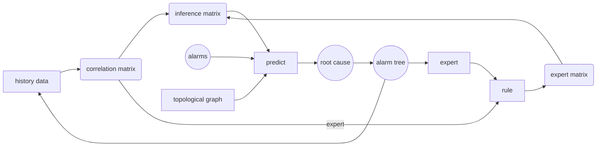

**Project**: Proof-of-concept (PoC) of AN (autonomous network) in communication network.
**Project Target**:
-	build up an intelligent system which can detect, fix and even predict possible problems with the analysis of alarms, device information and other details in the communication network to reduce human costs while lifting efficiency\
-	Stage I can be roughly divided into three parts: workflow construction, message handling and root cause analysis (RCA). 

My task is to propose an RCA algorithm. The RCA algorithms should be able to find the root cause and the root cause tree from a bunch of alarms. Multiple algorithms have been considered, and here are some of them:
-	FP-Growth
-	GCN
-	Random Forest
-	Correlation

**GCN**: 
With the help of AI, we first considered using graph convolutional network (GCN). Like CNN (convolutional neural network), GCN considers a network’s topology, aggregates information from nearby nodes and uses learning algorithms like Feed-Forward Neural Network (FNN) to train the model for desirable outcomes. It seems that GCN fits RCA well since GCN leverages the topology structure, but one problem is that the training data lacks labels. Though experts have given some figures showing alarms’ levels of harmfulness, no real relation is given. Besides, GCN can not be used to find the root cause directly, since one GCN layer means aggregating information around once, and two layers only aggregate information twice. If the root cause tree has a high height, all the information cannot be delivered to the root cause. However, one layer can be used to find the relationship between neighboring alarms, and one of my colleagues is trying this algorithm.

**Random Forest**:
AI also proposes algorithms like Random Forest (RF). However, after learning the basic concepts and logic of RF and reading some relative papers, there is one major difference between the RCAs using RF and the problem that we are facing. When using RF, researchers are actually doing system level RCA, with data including Software version, hardware type, device temperature, etc. What we have are only alarms, meaning that we are doing alarm level RCA, so RF is not that useful. In the future, when all these data are available, then system level RCA can be achieved, and algorithms like RF can even predict alarms that have not happened.

**Correlation**:
To solve the problem, I decided to change the problem from finding the root cause and the relationship between alarms into finding the correlation between alarms: when one alarm shows up, what is the possibility of another alarm to show up? Then, correlation can be used as the relationship between alarms to find the root cause.

The key concept of my algorithm is to get the prob_trans_matrix, which records all the probability for each alarm to be other alarms' root cause. Then, by giving each alarm in the predicted batch equal probability of being the root cause, we can see how information flows by applying dot product to these two things. After multiple times, we obtain the probability of each alarm to be a root cause. There are alarms seen as root causes, alarms caused by other alarms, and alarms that are totally separated from other alarms. We only report the alarms taken as root causes, and store all the alarms into our database with their father alarms (alarms that lead to them).

If all the rules are stored, then the prob_trans_matrix provides an easy-to-understand and easy-to-modify way of solving RCA problem. The target takes some time to reach, since expert need time to define and verify rules, so we can try to calculate the correlation of alarms and propose possible rules with high probability.

My way of finding so-called "correlation" between two alarms is quite simple. First, get the frequency for alarms to appear together. Then, if one alarm has no relation with another alarm, set the frequency to 0. Also, if two alarms have obvious cause-and-effect relationship, only store one of the two data. This provides us with the rough version of prob_trans_matrix, but still too rough. To provide better result, we can first introduce expert rules if there are existing rules to prevent information spreading to unrelated or even false alarms. Also, one property of each alarm called root_weight enables us to put on weight to these correlation. I created a function f(x), where f(x)=x+1 when x>=0, f(x)=e^(5x) when x<0. This enables us to give a gentle bonus for right correlation and huge penalty for wrong ones after changing root_weight so its values range from 0 to 1.

By having the prob_trans_matrix following the steps above, we can easily find some pairs of alarms with high probability of being rules. We extract them, storing them into database, and wait for experts to verify these rules.

Reference
A Gentle Introduction to Graph Neural Networks https://distill.pub/2021/gnn-intro/
Discovering Alarm Correlation Rules for
Network Fault Management https://www.philippe-fournier-viger.com/2020_AIOPS_Alarm_correlation_rules.pdf

An Influence-based Approach for Root Cause Alarm Discovery in Telecom Networks https://doi.org/10.48550/arXiv.2105.03092